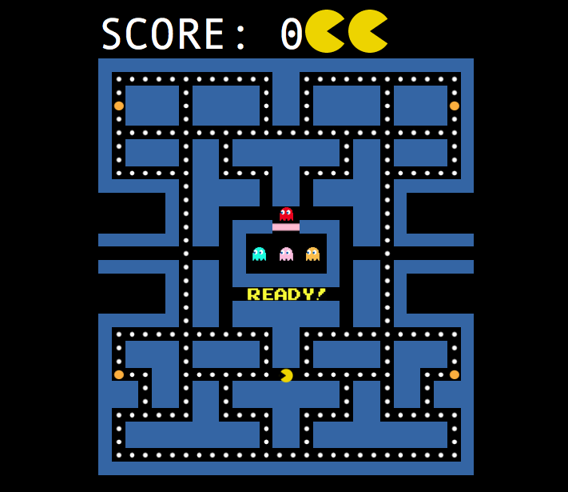

# pacman

The game of Pacman implemented in [Elm](http://elm-lang.org/) using Functional Reactive Programming (FRP) as part of the Functional Programming Final Project [CMSC](http://collegecatalog.uchicago.edu/thecollege/computerscience/) 23300.

## Usage

1. Install [Elm](http://elm-lang.org/install) version 0.16
2. Clone this repository and `cd` into it
3. Run `elm-reactor`
4. Visit <http://localhost:8000/Display.elm>
